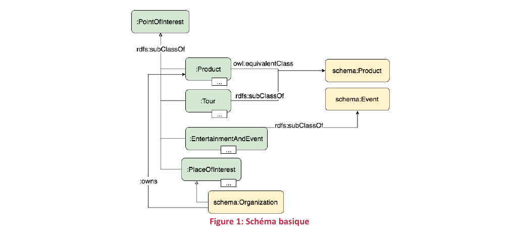
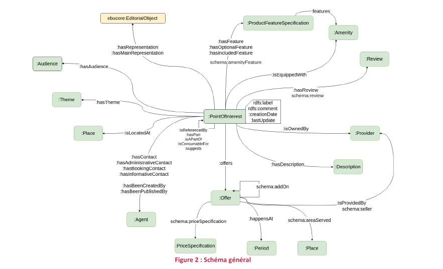
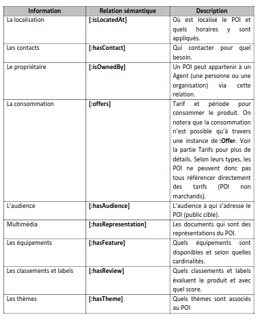
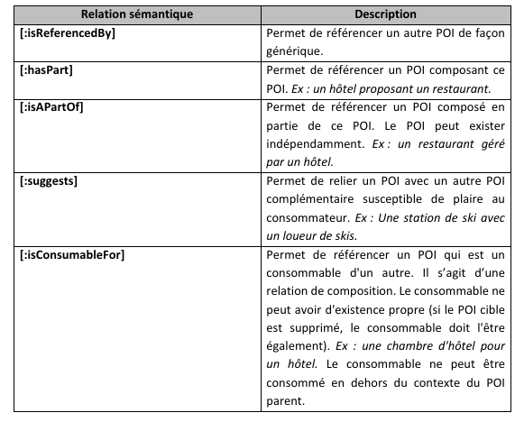

## Projet Itineraire

    L’objectif du projet est la création d’une application permettant de proposer un itinéraire selon certains critères.
    L’utilisateur de l’application choisit des zones / points d’intérêt à visiter lors de son prochain voyage, ainsi que la durée du séjour et l’app lui propose un 
    itinéraire détaillé optimisant son temps de voyage et de séjour.
    Le projet peut être éventuellement amélioré en se basant également sur les catégories des lieux choisis, ou les notes présentes sur TripAdvisor (par exemple).

## Liste des Use case

| Use case                         | Input                            |
|----------------------------------|----------------------------------|
| Optimisation itinéraire détaillé | zones et POI durée du séjour |

## Data Model

## Données selectionnées

| Description        | json reference               |
|--------------------|------------------------------|
| unique ID          | dc:identifier                |
| description du POI | rdfs:comment[fr]             |
| Nom                | rdfs:label[fr]               |
| email              | hasContact[schema:email]     |
| telephone          | hasContact[schema:telephone] |
| adresse            | isLocatedAt[schema:address]  |
| geo localisation   | isLocatedAt[schema:geo]  |
| ouverture          | schema:startDate |
| fermeture          | schema:endDate |
| URL                | foaf:homepage |

## Annex 1

## Datatourisme ontologie

Datatourisme concept se base sur un document d’ontologie. Cette ontologie est destinée à structurer les données décrivant l’ensemble des points d’intérêts touristiques: https://gitlab.adullact.net/adntourisme/datatourisme/ontology/-/blob/master/Documentation/Doc-ontologie-3.1.0-FR.pdf
https://gitlab.adullact.net/adntourisme/datatourisme/ontology

Graphe de l’ondotologie: https://info.datatourisme.fr/ontology/visualization/

## Concept central

    Le concept central est le "Point of Interest" qui s'articule autour de 4 sous-type

    :Product
    :Tour
    :EntertainmentAndEvent
    :PlaceOfInterest

## Principal propriétés et relations

### Un POI aggrege les informations suivantes 

### Un POI reference d'autres POI comme suit 

## Data Modeling

### Business case

