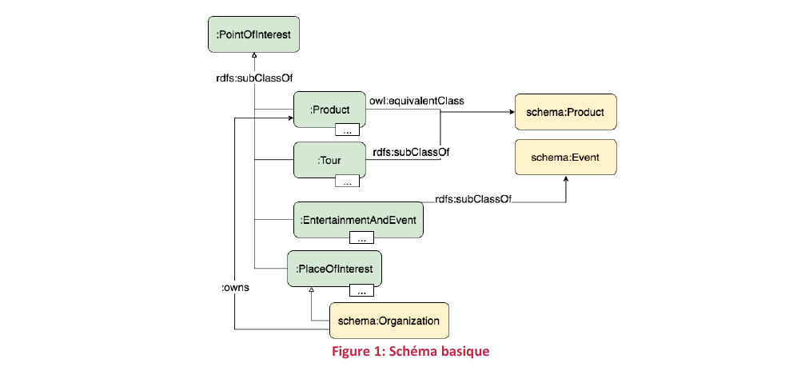
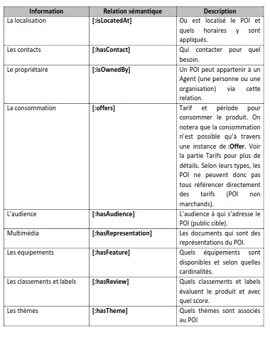
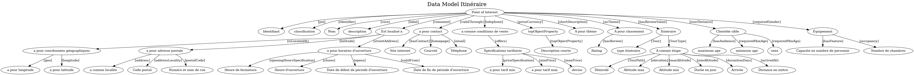

## Projet Itineraire

    L’objectif du projet est la création d’une application permettant de proposer un itinéraire selon certains critères.
    L’utilisateur de l’application choisit des zones / points d’intérêt à visiter lors de son prochain voyage, ainsi que la durée du séjour et l’app lui propose un 
    itinéraire détaillé optimisant son temps de voyage et de séjour.
    Le projet peut être éventuellement amélioré en se basant également sur les catégories des lieux choisis, ou les notes présentes sur TripAdvisor (par exemple).

## Liste des Use case

| Use case                         | Input                            |
|----------------------------------|----------------------------------|
| Optimisation itinéraire détaillé | zones et POI durée du séjour |

## Datatourisme ontologie

Datatourisme concept se base sur un document d’ontologie. Cette ontologie est destinée à structurer les données décrivant l’ensemble des points d’intérêts touristiques: https://gitlab.adullact.net/adntourisme/datatourisme/ontology/-/blob/master/Documentation/Doc-ontologie-3.1.0-FR.pdf
https://gitlab.adullact.net/adntourisme/datatourisme/ontology

Graphe de l’ondotologie: https://info.datatourisme.fr/ontology/visualization/

## Concept central

    Le concept central est le "Point of Interest" qui s'articule autour de 4 sous-type

    :Product
    :Tour
    :EntertainmentAndEvent
    :PlaceOfInterest

### Un POI aggrege les informations suivantes 

## Data Model: Concept pour le projet Itineraire (basé sur Use case retenus)

## Dictionnaire des données

| object_dm                            | json_tag                    | description_tag                                                                                                   |
| ------------------------------------ | --------------------------- | ----------------------------------------------------------------------------------------------------------------- |
| Point of Interest                    | [poi]                       |                                                                                                                   |
| Identifiant                          | [identifier]                | An unambiguous reference to the resource within a given context.                                                  |
| classification                       | [core]                      | La classification de POI. Par exemple : festival, musée, chambre d’hôtes…                                         |
| Nom                                  | [label]                     | Nom du POI                                                                                                        |
| description                          | [comment]                   | Description du POI                                                                                                |
| Est localisé à                       | [isLocatedAt]               | Où est localisé le POI et quels horaires y sont appliqués.                                                        |
| a pour coordonnées géographiques     | [geo]                       | La localisation du POI, et donc le lieu où il peut être potentiellement consommé. Lieu de départ d'un itinéraire. |
| a pour longitude                     | [longitude]                 | Valeur de la longitude de la ressource.                                                                           |
| a pour latitude                      | [latitude]                  | Valeur de la latitude de la ressource.                                                                            |
| a pour adresse postale               | [address]                   | L'adresse postale du lieu concerné                                                                                |
| a comme localité                     | [addressLocality]           | La localité de cette addresse (code INSEE de la commune)                                                          |
| Code postal                          | [postalCode]                | Le code postal d'une adresse.                                                                                     |
| Numéro et nom de rue                 | [streetAddress]             | Le nom de rue incluant le numéro d'une adresse.                                                                   |
| a pour horaires d'ouverture          | [openingHoursSpecification] | Les heures d'ouverture d'un lieu/service/produit.                                                                 |
| Heure de fermeture                   | [closes]                    | La date de début de la période d'ouverture (aaaa-mm-jjThh:mm:ss).                                                 |
| Heure d'ouverture                    | [opens]                     | La date de fin de la période d'ouverture (aaaa-mm-jjThh:mm:ss).                                                   |
| Date de début de période d'ouverture | [validFrom]                 | Date ouverture POI                                                                                                |
| Date de fin de période d'ouverture   | [validThrough]              | Date fermeture POI                                                                                                |
| a pour contact                       | [hasContact]                | Contact POI                                                                                                       |
| Site internet                        | [homepage]                  | Site internet POI                                                                                                 |
| Courriel                             | [email]                     | email POI                                                                                                         |
| Téléphone                            | [telephone]                 | Telephone POI                                                                                                     |
| a comme conditions de vente          | [offers]                    | Condition tarifaire                                                                                               |
| Spécifications tarifaires            | [priceSpecification]        | Specification tarifaire                                                                                           |
| a pour tarif min                     | [minPrice]                  | prix minimum                                                                                                      |
| a pour tarif max                     | [maxPrice]                  | prix maximum                                                                                                      |
| devise                               | [priceCurrency]             | devise                                                                                                            |
| topObjectProperty                    | [topObjectProperty]         | Propriete du POI                                                                                                  |
| Description courte                   | [shortDescription]          | Courte description POI                                                                                            |
| A pour thème                         | [asTheme]                   | Theme du POI                                                                                                      |
| A pour classement                    | [hasReview]                 | Quels classements et labels évaluent le produit et avec quel score.                                               |
| Rating                               | [hasReviewValue]            | Note du POI                                                                                                       |
| Itinéraire                           | [Tour]                      | Itineraire                                                                                                        |
| type itinéraire                      | [TourType]                  | Type d’itineraire                                                                                                 |
| A comme étape                        | [TourPath]                  | Etape de l’itineraire                                                                                             |
| Dénivelé                             | [elevation]                 | denivelé de l’itineraire                                                                                          |
| Altitude max                         | [maxAltitude]               | Altitude max                                                                                                      |
| Altitude min                         | [minAltitude]               | Altitude min                                                                                                      |
| Durée en jour                        | [durantionDays]             | Duree en jour de l’itineraire                                                                                     |
| Arrivée                              | [arrivedAt]                 | Lieu de destination de l’itineraire                                                                               |
| Distance en mètre                    | [tourDistance]              | Distance en metre de l’itineraire                                                                                 |
| Clientèle cible                      | [hasAudience]               | clientèle cible du POI                                                                                            |
| maximum age                          | [requiredMaxAge]            | age max du POI                                                                                                    |
| minimum age                          | [requiredMinAge]            | age min du POI                                                                                                    |
| sexe                                 | [requiredGender]            | sexe exige du POI                                                                                                 |
| Équipement                           | [hasFeature]                | equipement du POI                                                                                                 |
| Capacité en nombre de personne       | [occupancy]                 | capacite en nombre de personnes du POI                                                                            |
| Nombre de chambres                   | [numberOf Rooms]            | nombre de chambre du POI                                                                                          |

